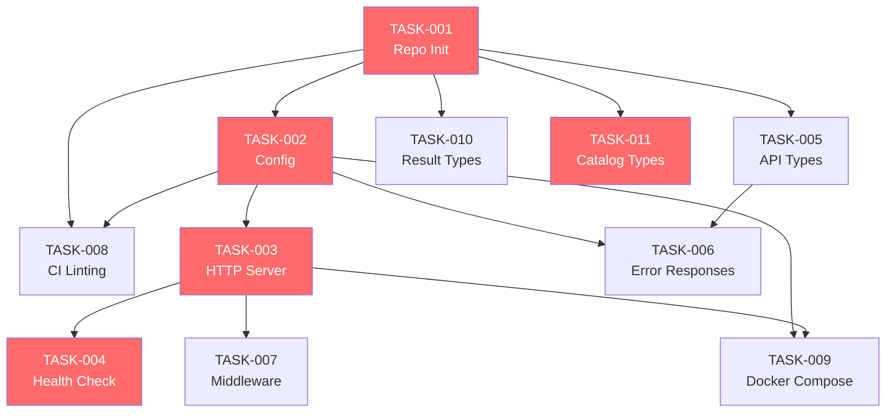
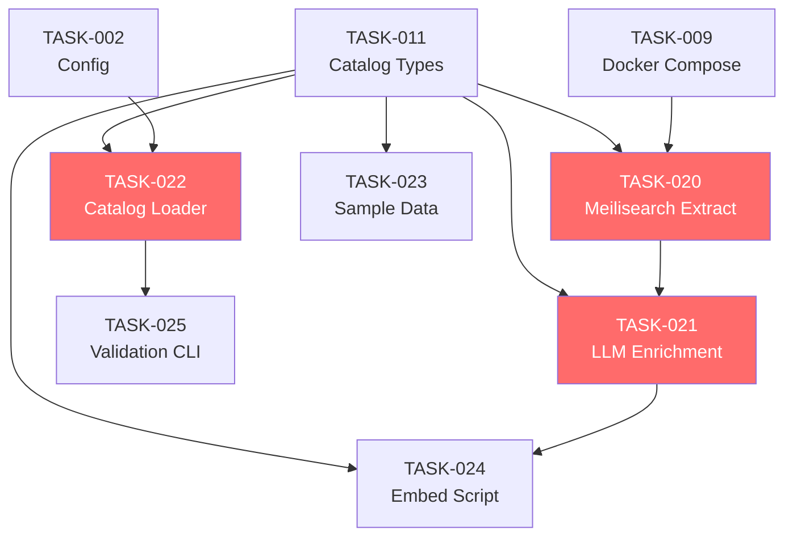
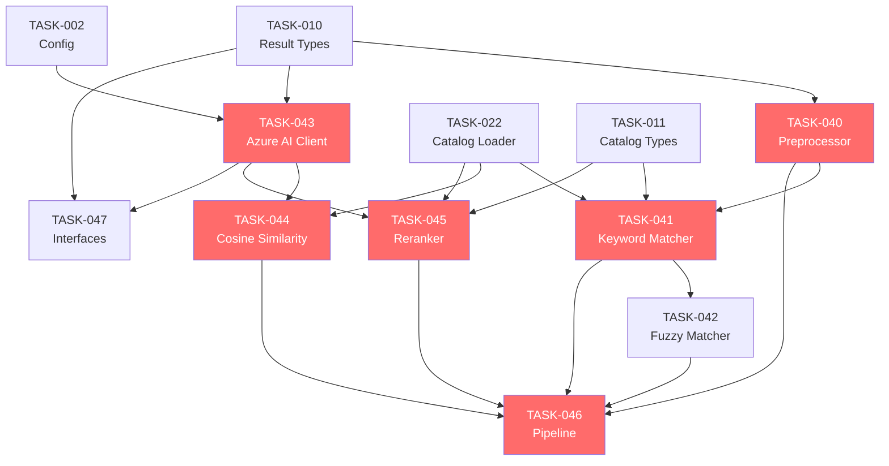
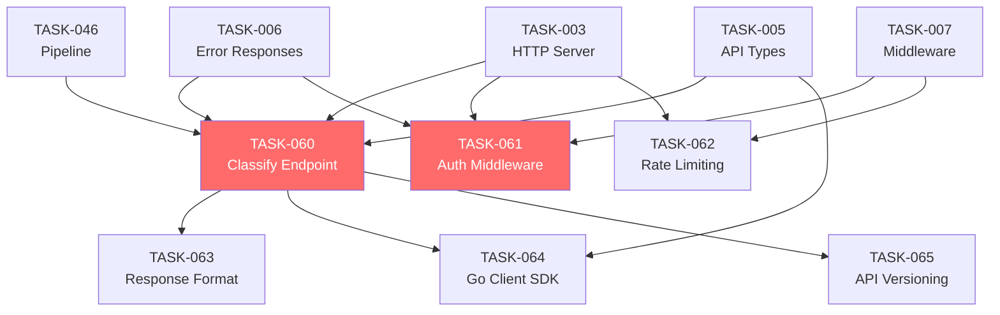
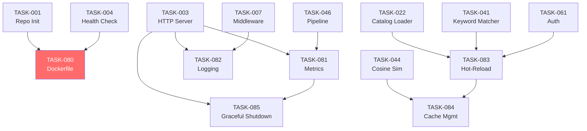
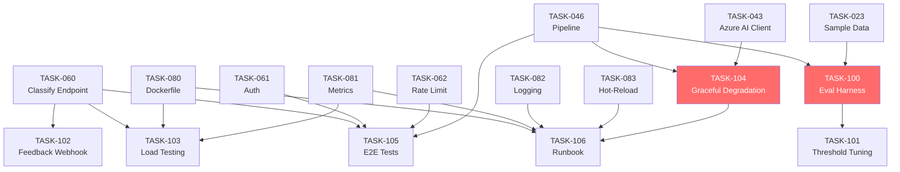

# Kairos Task Plan Index

> **Kairos** — **K**aseya **A**I **R**ecognition & **O**rchestrated **S**election
>
> Comprehensive implementation task breakdown for the Kairos zero-shot product classification microservice.

---

## Legend

### Metadata Fields

| Field | Description |
|-------|-------------|
| **Phase** | Implementation phase (1-6), determines execution order |
| **Module** | Primary codebase module this task affects |
| **Priority** | P0-critical (blocking), P1-high (important), P2-medium (enhancing), P3-low (nice-to-have) |
| **Estimated Effort** | Calendar time for one engineer |
| **Owner Role** | The skill set needed to execute |

### Status Values

| Status | Meaning |
|--------|---------|
| `planned` | Task is defined but work has not started |
| `in_progress` | Actively being worked on |
| `blocked` | Cannot proceed due to unmet dependency |
| `completed` | Work is done and acceptance criteria are met |
| `deferred` | Postponed to a future iteration |

### Priority Definitions

| Priority | Description |
|----------|-------------|
| **P0-critical** | Must be completed for the service to function at all |
| **P1-high** | Required for production readiness |
| **P2-medium** | Important for operational excellence |
| **P3-low** | Nice-to-have, can be deferred |

---

## Phase Summary

| Phase | Name | Tasks | P0 | P1 | P2 | P3 | Est. Effort |
|-------|------|-------|----|----|----|----|-------------|
| 1 | Project Scaffold | 11 | 4 | 4 | 2 | 1 | 8-15 days |
| 2 | Catalog Build | 6 | 3 | 2 | 1 | 0 | 9-15 days |
| 3 | Classification Pipeline | 8 | 5 | 2 | 0 | 1 | 14-22 days |
| 4 | API & Integration | 6 | 2 | 2 | 1 | 1 | 5-9 days |
| 5 | Operations | 6 | 1 | 3 | 2 | 0 | 7-11 days |
| 6 | Evaluation & Hardening | 7 | 2 | 3 | 2 | 0 | 12-19 days |
| **Total** | | **44** | **17** | **16** | **8** | **3** | **55-91 days** |

---

## Phase 1: Project Scaffold

| Task ID | Title | Module | Priority | Blocked By | Est. Effort |
|---------|-------|--------|----------|------------|-------------|
| TASK-001 | [Repo Init and Go Module](phase-1-project-scaffold/001-repo-init-and-go-module.md) | cmd | P0-critical | None | 4-8 hrs |
| TASK-002 | [Config and Env Parsing](phase-1-project-scaffold/002-config-and-env-parsing.md) | config | P0-critical | TASK-001 | 1-2 days |
| TASK-003 | [HTTP Server Skeleton](phase-1-project-scaffold/003-http-server-skeleton.md) | cmd | P0-critical | TASK-001, TASK-002 | 1-2 days |
| TASK-004 | [Health Check Endpoint](phase-1-project-scaffold/004-health-check-endpoint.md) | api | P0-critical | TASK-003 | 4-8 hrs |
| TASK-005 | [Request/Response Types](phase-1-project-scaffold/005-request-response-types.md) | api | P1-high | TASK-001 | 4-8 hrs |
| TASK-006 | [Structured Error Responses](phase-1-project-scaffold/006-structured-error-responses.md) | api | P1-high | TASK-002, TASK-005 | 4-8 hrs |
| TASK-007 | [Middleware Foundation](phase-1-project-scaffold/007-middleware-foundation.md) | api | P1-high | TASK-002, TASK-003 | 4-8 hrs |
| TASK-008 | [CI Linting Setup](phase-1-project-scaffold/008-ci-linting-setup.md) | infra | P2-medium | TASK-001, TASK-002 | 4-8 hrs |
| TASK-009 | [Docker Compose Dev](phase-1-project-scaffold/009-docker-compose-dev.md) | infra | P2-medium | TASK-001, TASK-002, TASK-003 | 4-8 hrs |
| TASK-010 | [Classification Result Types](phase-1-project-scaffold/010-classification-result-types.md) | classify | P1-high | TASK-001 | 4-8 hrs |
| TASK-011 | [Catalog Types](phase-1-project-scaffold/011-catalog-types.md) | catalog | P0-critical | TASK-001 | 4-8 hrs |

## Phase 2: Catalog Build

| Task ID | Title | Module | Priority | Blocked By | Est. Effort |
|---------|-------|--------|----------|------------|-------------|
| TASK-020 | [Meilisearch Extraction Script](phase-2-catalog-build/020-meilisearch-extraction-script.md) | scripts | P0-critical | TASK-001, TASK-009, TASK-011 | 2-3 days |
| TASK-021 | [LLM Enrichment Pipeline](phase-2-catalog-build/021-llm-enrichment-pipeline.md) | scripts | P0-critical | TASK-020, TASK-011 | 3-5 days |
| TASK-022 | [Catalog Loader and Validator](phase-2-catalog-build/022-catalog-loader-and-validator.md) | catalog | P0-critical | TASK-002, TASK-011 | 2-3 days |
| TASK-023 | [Sample Catalog Data](phase-2-catalog-build/023-sample-catalog-data.md) | catalog | P1-high | TASK-011 | 1-2 days |
| TASK-024 | [Embedding Generation Script](phase-2-catalog-build/024-embedding-generation-script.md) | scripts | P1-high | TASK-021, TASK-011 | 1-2 days |
| TASK-025 | [Catalog Validation CLI](phase-2-catalog-build/025-catalog-validation-cli.md) | scripts | P2-medium | TASK-011, TASK-022 | 4-8 hrs |

## Phase 3: Classification Pipeline

| Task ID | Title | Module | Priority | Blocked By | Est. Effort |
|---------|-------|--------|----------|------------|-------------|
| TASK-040 | [Preprocessor](phase-3-classification-pipeline/040-preprocessor.md) | preprocess | P0-critical | TASK-010 | 1-2 days |
| TASK-041 | [Tier 1 Keyword Matcher](phase-3-classification-pipeline/041-tier1-keyword-matcher.md) | tier1 | P0-critical | TASK-010, TASK-011, TASK-022, TASK-040 | 2-3 days |
| TASK-042 | [Tier 1 Fuzzy Matcher](phase-3-classification-pipeline/042-tier1-fuzzy-matcher.md) | tier1 | P1-high | TASK-010, TASK-011, TASK-022, TASK-040, TASK-041 | 1-2 days |
| TASK-043 | [Azure AI Foundry Client](phase-3-classification-pipeline/043-azure-ai-client.md) | azureai | P0-critical | TASK-002, TASK-010 | 2-3 days |
| TASK-044 | [Tier 2 Cosine Similarity](phase-3-classification-pipeline/044-tier2-cosine-similarity.md) | tier2 | P0-critical | TASK-010, TASK-022, TASK-043 | 2-3 days |
| TASK-045 | [Tier 3 Reranker](phase-3-classification-pipeline/045-tier3-reranker.md) | tier3 | P0-critical | TASK-010, TASK-011, TASK-022, TASK-043 | 2-3 days |
| TASK-046 | [Pipeline Orchestrator](phase-3-classification-pipeline/046-pipeline-orchestrator.md) | classify | P0-critical | TASK-010, TASK-040, TASK-041, TASK-042, TASK-044, TASK-045 | 2-3 days |
| TASK-047 | [Tier Interfaces and Mocks](phase-3-classification-pipeline/047-tier-interfaces-and-mocks.md) | classify | P1-high | TASK-010, TASK-043 | 4-8 hrs |

## Phase 4: API & Integration

| Task ID | Title | Module | Priority | Blocked By | Est. Effort |
|---------|-------|--------|----------|------------|-------------|
| TASK-060 | [Classify Endpoint](phase-4-api-and-integration/060-classify-endpoint.md) | api | P0-critical | TASK-003, TASK-005, TASK-006, TASK-046 | 1-2 days |
| TASK-061 | [Auth Middleware](phase-4-api-and-integration/061-auth-middleware.md) | api | P0-critical | TASK-003, TASK-006, TASK-007 | 4-8 hrs |
| TASK-062 | [Rate Limiting](phase-4-api-and-integration/062-rate-limiting.md) | api | P1-high | TASK-003, TASK-006, TASK-007 | 1-2 days |
| TASK-063 | [Response Formatting](phase-4-api-and-integration/063-response-formatting.md) | api | P2-medium | TASK-005, TASK-006, TASK-060 | 4-8 hrs |
| TASK-064 | [Go Client SDK](phase-4-api-and-integration/064-go-client-sdk.md) | client-sdk | P2-medium | TASK-005, TASK-060 | 1-2 days |
| TASK-065 | [API Versioning](phase-4-api-and-integration/065-api-versioning.md) | api | P3-low | TASK-060 | 4-8 hrs |

## Phase 5: Operations

| Task ID | Title | Module | Priority | Blocked By | Est. Effort |
|---------|-------|--------|----------|------------|-------------|
| TASK-080 | [Dockerfile and Build](phase-5-operations/080-dockerfile-and-build.md) | infra | P0-critical | TASK-001, TASK-004 | 1-2 days |
| TASK-081 | [Prometheus Metrics](phase-5-operations/081-prometheus-metrics.md) | api | P1-high | TASK-003, TASK-046 | 2-3 days |
| TASK-082 | [Structured Logging](phase-5-operations/082-structured-logging.md) | api | P1-high | TASK-003, TASK-007 | 1-2 days |
| TASK-083 | [Catalog Hot-Reload](phase-5-operations/083-catalog-hot-reload.md) | catalog | P2-medium | TASK-022, TASK-041, TASK-061 | 1-2 days |
| TASK-084 | [Embedding Cache Management](phase-5-operations/084-embedding-cache-management.md) | tier2 | P2-medium | TASK-044, TASK-083 | 4-8 hrs |
| TASK-085 | [Graceful Shutdown](phase-5-operations/085-graceful-shutdown.md) | cmd | P1-high | TASK-003, TASK-081 | 4-8 hrs |

## Phase 6: Evaluation & Hardening

| Task ID | Title | Module | Priority | Blocked By | Est. Effort |
|---------|-------|--------|----------|------------|-------------|
| TASK-100 | [Eval Harness](phase-6-evaluation-and-hardening/100-eval-harness.md) | scripts | P0-critical | TASK-046, TASK-023 | 3-5 days |
| TASK-101 | [Threshold Tuning](phase-6-evaluation-and-hardening/101-threshold-tuning.md) | scripts | P1-high | TASK-100 | 1-2 days |
| TASK-102 | [Feedback Loop Webhook](phase-6-evaluation-and-hardening/102-feedback-loop-webhook.md) | api | P2-medium | TASK-060 | 1-2 days |
| TASK-103 | [Load Testing](phase-6-evaluation-and-hardening/103-load-testing.md) | infra | P1-high | TASK-060, TASK-080, TASK-081 | 1-2 days |
| TASK-104 | [Graceful Degradation](phase-6-evaluation-and-hardening/104-graceful-degradation.md) | classify | P0-critical | TASK-046, TASK-043 | 2-3 days |
| TASK-105 | [E2E Integration Tests](phase-6-evaluation-and-hardening/105-end-to-end-integration-tests.md) | api | P1-high | TASK-060, TASK-061, TASK-062, TASK-046 | 2-3 days |
| TASK-106 | [Operational Runbook](phase-6-evaluation-and-hardening/106-operational-runbook.md) | infra | P2-medium | TASK-080, TASK-081, TASK-082, TASK-083, TASK-104 | 1-2 days |

---

## Critical Path Analysis

The critical path is the longest dependency chain that determines the minimum project duration:

```
TASK-001 (Repo Init)
  → TASK-002 (Config)
    → TASK-003 (HTTP Server)
      → TASK-007 (Middleware)
        → TASK-061 (Auth)
```

**Parallel critical path for classification pipeline:**

```
TASK-001 (Repo Init)
  → TASK-011 (Catalog Types)
    → TASK-022 (Catalog Loader)
      → TASK-041 (Tier 1 Keyword)
        → TASK-042 (Tier 1 Fuzzy)
          → TASK-046 (Pipeline Orchestrator)
            → TASK-060 (Classify Endpoint)
              → TASK-100 (Eval Harness)
                → TASK-101 (Threshold Tuning)
```

**Critical path length:** TASK-001 → TASK-011 → TASK-022 → TASK-041 → TASK-042 → TASK-046 → TASK-060 → TASK-100 → TASK-101

**Estimated critical path duration:** ~17-30 days

### Parallelization Opportunities

Several workstreams can proceed in parallel:

1. **Config + Types** (TASK-002, TASK-005, TASK-010, TASK-011) — All depend only on TASK-001
2. **Azure AI Client** (TASK-043) — Can start once TASK-002 is done, independent of catalog work
3. **CI/Docker** (TASK-008, TASK-009, TASK-080) — Independent infrastructure track
4. **Catalog Build Scripts** (TASK-020, TASK-021, TASK-024) — Can run in parallel with core pipeline dev using sample data
5. **Operations** (TASK-081, TASK-082) — Can start once HTTP server exists (TASK-003)

---

## Dependency Graphs

### Phase 1: Project Scaffold



### Phase 2: Catalog Build



### Phase 3: Classification Pipeline



### Phase 4: API & Integration



### Phase 5: Operations



### Phase 6: Evaluation & Hardening



---

## Module Legend

| Module | Package | Description |
|--------|---------|-------------|
| cmd | `cmd/server/` | Application entry point |
| api | `internal/api/` | HTTP handlers, middleware, routes |
| catalog | `internal/catalog/` | Product catalog loading and indexing |
| classify | `internal/classify/` | Pipeline orchestrator and result types |
| tier1 | `internal/tier1/` | Keyword/alias matching |
| tier2 | `internal/tier2/` | Semantic embedding similarity |
| tier3 | `internal/tier3/` | LLM reranker |
| azureai | `internal/azureai/` | Azure AI Foundry client |
| preprocess | `internal/preprocess/` | Text normalization |
| config | `internal/config/` | Configuration and environment parsing |
| client-sdk | `pkg/client/` | Go client SDK for consumers |
| scripts | `scripts/` | Build-time tooling (extract, enrich, eval) |
| infra | Root files | Dockerfile, CI, Makefile, docker-compose |
